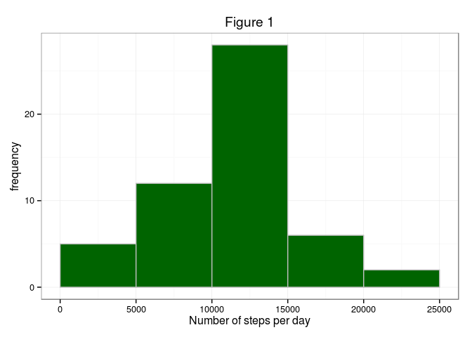
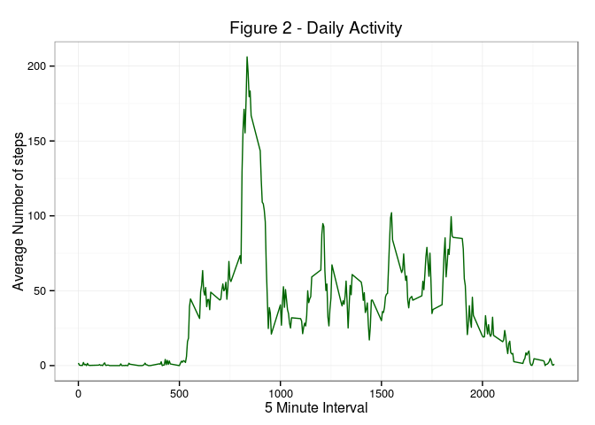
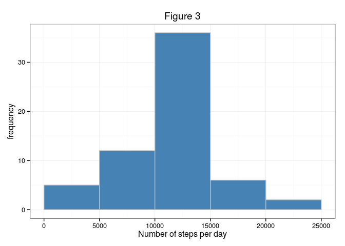
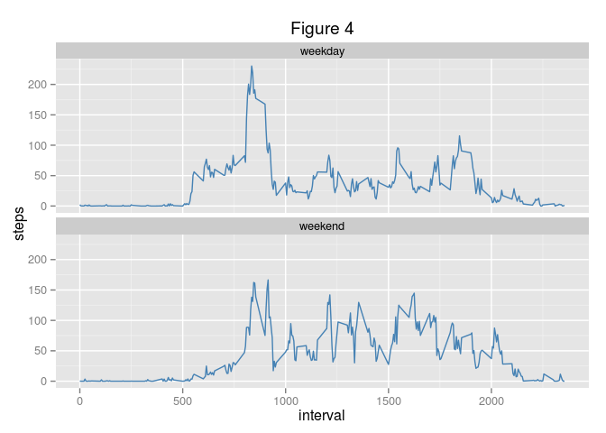

# Reproducible Research: Peer Assessment 1


## Loading and preprocessing the data

```r
if(!file.exists('activity.csv')){unzip('activity.zip')}
activity <- read.csv('activity.csv')
head(activity)
```

```
##   steps       date interval
## 1    NA 2012-10-01        0
## 2    NA 2012-10-01        5
## 3    NA 2012-10-01       10
## 4    NA 2012-10-01       15
## 5    NA 2012-10-01       20
## 6    NA 2012-10-01       25
```


```r
## remove NAs
nona_activity <- activity[complete.cases(activity),]
```

## What is mean total number of steps taken per day?
#### 1. Histogram - Total number of steps per day (Figure 1)
Ignoring NAs:-

```r
total_steps = aggregate(steps ~ date, nona_activity, sum)
head(total_steps)
```

```
##         date steps
## 1 2012-10-02   126
## 2 2012-10-03 11352
## 3 2012-10-04 12116
## 4 2012-10-05 13294
## 5 2012-10-06 15420
## 6 2012-10-07 11015
```

```r
library(ggplot2)
ggplot(total_steps, aes(steps)) + geom_histogram(fill = "darkgreen", col="grey",
    breaks = c(0, 5000, 10000, 15000, 20000, 25000)) + labs(y = expression("frequency")) + 
    labs(x = expression("Number of steps per day")) + labs(title = expression("Figure 1"))+
    theme_bw()
```

 

#### 2. Mean and median

```r
# Mean
mean(total_steps$steps)
```

```
## [1] 10766.19
```

```r
# Median
median(total_steps$steps)
```

```
## [1] 10765
```

## What is the average daily activity pattern?
#### 1. Make a time series plot of the 5-minute interval (x-axis) and the average number of steps taken, averaged across all days (y-axis)

```r
pattern = aggregate(activity$steps ~ activity$interval, activity, FUN=mean, na.rm=T)
names(pattern) = c("Interval", "Average_Steps")
ggplot(pattern, aes(x=Interval, y=Average_Steps)) + geom_line(col="darkgreen")+
  xlab("5 Minute Interval")+ylab("Average Number of steps") + labs(title = expression("Figure 2 - Daily Activity")) + theme_bw()
```

 


#### 2. Which 5-minute interval, on average across all the days in the dataset, contains the maximum number of steps?

```r
pattern[pattern$Average_Steps==max(pattern$Average_Steps),]
```

```
##     Interval Average_Steps
## 104      835      206.1698
```
## Imputing missing values
#### 1. Calculate and report the total number of missing values in the dataset.

```r
nrow(activity[is.na(activity$steps),])
```

```
## [1] 2304
```
There are 2304 missing values in this dataset representing 13% of the dataset.


#### 2. Devise a strategy for filling in all of the missing values in the dataset. The strategy does not need to be sophisticated. For example, you could use the mean/median for that day, or the mean for that 5-minute interval, etc.
I am going to use the mean of the 5-minute interval to populate NA values for a given internval.

#### 3. New dataset with the missing values filled.

```r
library(plyr)
# copy data frame
activity_1 = activity
spi = ddply(activity, .(interval), summarize, steps = mean(steps, na.rm=TRUE))
row.names(spi) = spi$interval
index = which(is.na(activity_1$steps))
activity_1[index,1] = spi[as.factor(activity_1[index,3]),2]
```
The head of the new dataset (NAs filled in)

```r
head(activity_1)
```

```
##       steps       date interval
## 1 1.7169811 2012-10-01        0
## 2 0.3396226 2012-10-01        5
## 3 0.1320755 2012-10-01       10
## 4 0.1509434 2012-10-01       15
## 5 0.0754717 2012-10-01       20
## 6 2.0943396 2012-10-01       25
```

#### 4. Make a histogram (Figure 3) of the total number of steps taken each day and Calculate and report the mean and median total number of steps taken per day.


```r
total_steps_1 = aggregate(steps ~ date, activity_1, sum)
ggplot(total_steps_1, aes(steps)) + geom_histogram(fill = "steelblue", col="grey",
    breaks = c(0, 5000, 10000, 15000, 20000, 25000)) + labs(y = expression("frequency")) + 
    labs(x = expression("Number of steps per day")) + labs(title = expression("Figure 3"))+
    theme_bw()
```

 

The mean and median (after replacing NAs)

```r
# Mean
mean(total_steps_1$steps)
```

```
## [1] 10766.19
```

```r
# Median
median(total_steps_1$steps)
```

```
## [1] 10766.19
```
The mean is 10766 and median 10766.
Let's calculate the differences between the first and second sets.


```r
# Mean differences
mean(total_steps_1$steps)-mean(total_steps$steps)
```

```
## [1] 0
```

```r
# Median differences
abs(median(total_steps_1$steps)-median(total_steps$steps))
```

```
## [1] 1.188679
```

```r
delta = abs(median(total_steps_1$steps)-median(total_steps$steps))/median(total_steps$steps)
paste(round(100*delta, 2), "%")
```

```
## [1] "0.01 %"
```

The variations in the mean and median values after imputation are 0 and 0.01% respectively. The missing values does not seem to have a material impact on the total average daily number of steps.

## Are there differences in activity patterns between weekdays and weekends?

#### 1. Create a new factor variable in the dataset for “weekday” or “weekend”

```r
final_activity = activity_1
final_activity$date <- strptime(final_activity$date, "%Y-%m-%d")
final_activity <- mutate(final_activity, day = weekdays(date))

weekend <- weekdays(as.Date(final_activity$date)) %in% c("Saturday", "Sunday")
final_activity$daytype <- "weekday"
final_activity$daytype[weekend == TRUE] <- "weekend"
final_activity$daytype <- as.factor(final_activity$daytype)
str(final_activity)
```

```
## 'data.frame':	17568 obs. of  5 variables:
##  $ steps   : num  1.717 0.3396 0.1321 0.1509 0.0755 ...
##  $ date    : POSIXlt, format: "2012-10-01" "2012-10-01" ...
##  $ interval: int  0 5 10 15 20 25 30 35 40 45 ...
##  $ day     : chr  "Monday" "Monday" "Monday" "Monday" ...
##  $ daytype : Factor w/ 2 levels "weekday","weekend": 1 1 1 1 1 1 1 1 1 1 ...
```

```r
table(final_activity$daytype)
```

```
## 
## weekday weekend 
##   12960    4608
```

#### 2. Panel plot (Figure 4) containing a time series plot of the 5-minute interval and the average number of steps taken, averaged across all weekday days or weekend days.


```r
average_summary = aggregate(final_activity$steps, list(interval = final_activity$interval, daytype = final_activity$daytype), mean)
names(average_summary) <- c("interval", "day", "steps")
ggplot(average_summary, aes(interval, steps)) + geom_line(color = "steelblue") + 
    facet_wrap(~day, ncol = 1) + labs(title = expression("Figure 4"))
```

 

There is an overall higher number of steps taken over the weekend.


